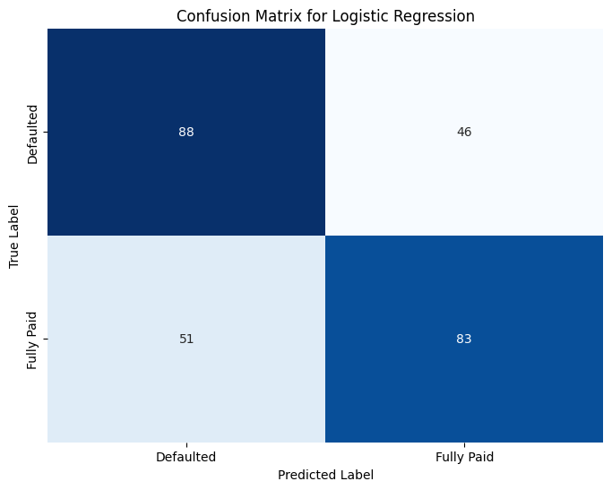

# Loan Default prediction 

In this notebook I am exploring a dataset looking at those who paid back their business loans on time and those who defaulted, and trying to predict whether a business is likely to default on their loan or not.

## Data Cleaning 

- Used One Hot Encoding for categorical columns
- Utilised Label Encoding for large categorical columns
- Implemented Standard Scalar
- Balanced classes to prevent bias in model building phase

## Model Building

3 different models were tested:
- Random Forest
- Logistic Regression
- XGBoost

L1 and L2 penalties were introduced to optimise feature selection and minimise multicolinearity between features.

## Conclusion
Due to the Limited data of one of the minority class, the results are not as accurate as I would have liked, however, with the use of regularisation techniques and hyperparameter tuning I was able to improve model accuracy, giving us the following results.

